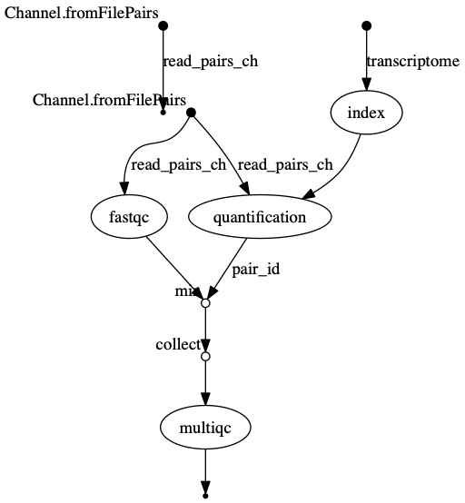

::::::::::::::::::::::::::::::::::::::: objectives

- Use the `println` function to print all the pipeline parameters.
- Create a simple genome assembly pipeline.
- Produce an execution report and generate run metrics from a pipeline run.

::::::::::::::::::::::::::::::::::::::::::::::::::

:::::::::::::::::::::::::::::::::::::::: questions

- How can I create a Nextflow pipeline from a series of unix commands and input data?
- How do I log my pipelines parameters?
- How can I manage my pipeline software requirements?
- How do I see how much resources my pipeline has used?

::::::::::::::::::::::::::::::::::::::::::::::::::


We're now set to develop a multi-step pipeline using Nextflow, for performing genome assembly on our bacterial DNA sequences.

In this genome assembly pipeline, we'll undertake the following steps to assemble bacterial sequence data:

1. **Quality Control with FastQC**: [FastQC](https://www.bioinformatics.babraham.ac.uk/projects/fastqc/) assesses the quality of the data by generating reports that highlight any potential issues, such as low-quality sequences or contamination. FastQC's output includes an HTML report and a directory containing detailed analyses, which are essential for evaluating the integrity of the sequencing data.

```bash
$ mkdir fastqc_<sample_id>_logs
$ fastqc -o fastqc_<sample_id>_logs -f fastq -q <reads>
```

2. **Read trimming with Seqtk**: [Seqtk](https://github.com/lh3/seqtk) is a fast and lightweight tool for processing sequences in the FASTA or FASTQ format. It seamlessly parses both FASTA and FASTQ files which can also be optionally compressed by gzip.

```bash
$ seqtk trimfq <read1> > <sample_id>_trimmed_R1.fastq
$ seqtk trimfq <read2> > <sample_id>_trimmed_R2.fastq
$ gzip *.fastq
```

3. **Genome Assembly with Shovill**: After trimming, [Shovill](https://github.com/tseemann/shovill) is used for genome assembly. Shovill is a pipeline which uses SPAdes at its core, but alters the steps before and after the primary assembly step to get similar results in less time.

```bash
$ shovill \
    --R1 <read1> \
    --R2 <read2> \
    --cpus <cpus> \
    --ram <memory> \
    --outdir ./<sample_id>_shovill_output \
    --force
$ mv <sample_id>_shovill_output/contigs.fa <sample_id>.fa
```

4. **Aggregating Reports with MultiQC**: Finally, the pipeline employs [MultiQC](https://multiqc.info/) to aggregate logs and output from FastQC. MultiQC scans the outputs and compiles a summary report, which provides an overview of the results and highlights any areas that may need further investigation.


```bash
$ multiqc .
```

To start move the episode's nextflow scripts in the `scripts/genomeassembly_pipeline` folder to your home directory.

```bash
$ cp scripts/genomeassembly_pipeline/* .
```

This folder contains files we will be modifying in this episode.

## Define the pipeline parameters

The first thing we want to do when writing a pipeline is define the pipeline parameters.
The script `script1.nf` defines the pipeline input parameters.

```groovy 
//script1.nf
params.reads = "data/bacteria/reads/*_{1,2}.fq.gz"

println "reads: $params.reads"
```

Run it by using the following command:

```bash
$ nextflow run script1.nf
```

We can specify a different input parameter using the `--<params>` option, for example :

```groovy 
$ nextflow run script1.nf --reads "data/bacteria/reads/sample1*_{1,2}.fq.gz"
```

```output 
reads: data/bacteria/reads/sample1*_{1,2}.fq.gz
```

:::::::::::::::::::::::::::::::::::::::  challenge

## Add a parameter

Modify the `script1.nf` adding a second parameter named `outdir` and set it to `results`. This parameter will be used as the pipeline output directory.

:::::::::::::::  solution

## Solution

```groovy 
params.outdir = "results"
```

:::::::::::::::::::::::::

::::::::::::::::::::::::::::::::::::::::::::::::::

It can be useful to print the pipeline parameters to the screen. This can be done using the the `println` command and a multiline string statement. The string method `.stripIndent()` command is used to remove the indentation on multi-line strings. `println` also saves the output to the log execution file `.nextflow.log`.

```groovy 
println """\
        reads: ${params.reads}
        outdir: ${params.outdir}
        """
        .stripIndent()
```

:::::::::::::::::::::::::::::::::::::::  challenge

## println

Modify the `script1.nf` to print all the pipeline parameters by using a single `println` command and a multiline string statement.
See an example [here](https://github.com/nextflow-io/rnaseq-nf/blob/3b5b49f/main.nf#L41-L48).

```bash 
$ nextflow run script1.nf
```

Look at the output log `.nextflow.log`.

:::::::::::::::  solution

## Solution

Below is an example println command printing all the pipeline parameters.

```groovy 
println """\
        G E N O M E A S S E M B L Y - N F   P I P E L I N E    
        ===================================
        reads        : ${params.reads}
        outdir       : ${params.outdir}
        """
        .stripIndent()
```

```bash 
$ less .nextflow.log
```

:::::::::::::::::::::::::

::::::::::::::::::::::::::::::::::::::::::::::::::

## Collect read files by pairs

This step shows how to match **read** files into pairs, so they can be trimmed by Seqtk and their quality assessed by FastQC.

The script `script2.nf` adds a line to create a channel, `read_pairs_ch`, containing fastq read pair files using the `fromFilePairs` channel factory.

```groovy 
//script2.nf
nextflow.enable.dsl = 2

/*
 * pipeline input parameters
 */
params.reads = "data/bacteria/reads/sample1_{1,2}.fq.gz"
params.outdir = "results"

println """\
         G E N O M E A S S E M B L Y - N F   P I P E L I N E
         ===================================
         reads        : ${params.reads}
         outdir       : ${params.outdir}
         """
         .stripIndent()


read_pairs_ch = Channel.fromFilePairs(params.reads)
```

We can view the contents  of the `read_pairs_ch` by adding the following statement as the last line:

```groovy 
read_pairs_ch.view()
```

Now if we execute it with the following command:

```bash 
$ nextflow run script2.nf
```

It will print an output similar to the one shown below that shows how the `read_pairs_ch` channel emits a tuple. The tuple is composed of two elements, where the first is the pattern matched by the glob pattern `data/bacteria/reads/sample1_{1,2}.fq.gz`, defined by the variable `params.reads`, and the second is a list representing the actual files.

```output 
[..truncated..]
[ref1, [data/bacteria/reads/sample1_1.fq.gz,data/bacteria/reads/sample1_2.fq.gz]]
```

To read in other read pairs  we can specify a different glob pattern in the `params.reads` variable by using `--reads` options on the command line. For example, the following command would read in add the ref samples:

```bash 
$ nextflow run script2.nf --reads 'data/bacteria/reads/sample*_{1,2}.fq.gz'
```

```output 
[..truncated..]
[ref2, [data/bacteria/reads/sample2_1.fq.gz, data/bacteria/reads/sample2_2.fq.gz]]
[ref3, [data/bacteria/reads/sample3_1.fq.gz, data/bacteria/reads/sample3_2.fq.gz]]
[ref1, [data/bacteria/reads/sample1_1.fq.gz, data/bacteria/reads/sample1_2.fq.gz]]
```

**Note** File paths including one or more wildcards ie. `*`, `?`, etc. MUST be wrapped in single-quoted characters to avoid Bash expanding the glob pattern on the command line.

We can also add a argument, `checkIfExists: true` , to the `fromFilePairs` channel factory to return an message if the file doesn't exist.

```groovy 
//script2.nf
[..truncated..]
read_pairs_ch = Channel.fromFilePairs( params.reads, checkIfExists: true )
```

If we now run the script with the `--reads` parameter `data/bacteria/reads/*_1,2}.fq.gz`

```bash 
$ nextflow run script2.nf --reads 'data/bacteria/reads/*_1,2}.fq.gz'
```

it will return the message .

```output 
[..truncated..]
No such file: data/bacteria/reads/*_1,2}.fq.gz
```

:::::::::::::::::::::::::::::::::::::::  challenge

## Read in all read pairs

1. Add  the `checkIfExists: true` argument to the `fromFilePairs` channel factory in `script2.nf`.
2. Using the command line parameter `--reads`, add a glob pattern to read in all the read pairs files from the `data/bacteria/reads` directory.

:::::::::::::::  solution

## Solution

```groovy 
read_pairs_ch =Channel.fromFilePairs(params.reads, checkIfExists: true)
```

```bash 
nextflow run script2.nf --reads 'data/bacteria/reads/*_{1,2}.fq.gz'
```

```output 
[..truncated..]
[temp33_1, [data/bacteria/reads/temp33_1_1.fq.gz, data/bacteria/reads/temp33_1_2.fq.gz]]
[ref2, [data/bacteria/reads/sample2_1.fq.gz, data/bacteria/reads/sample2_2.fq.gz]]
[temp33_3, [data/bacteria/reads/temp33_3_1.fq.gz, data/bacteria/reads/temp33_3_2.fq.gz]]
[ref3, [data/bacteria/reads/sample3_1.fq.gz, data/bacteria/reads/sample3_2.fq.gz]]
[temp33_2, [data/bacteria/reads/temp33_2_1.fq.gz,data/bacteria/reads/temp33_2_2.fq.gz]]
[etoh60_2, [data/bacteria/reads/etoh60_2_1.fq.gz,data/bacteria/reads/etoh60_2_2.fq.gz]]
[ref1, [data/bacteria/reads/sample1_1.fq.gz, data/bacteria/reads/sample1_2.fq.gz]]
[etoh60_3, [data/bacteria/reads/etoh60_3_1.fq.gz, data/bacteria/reads/etoh60_3_2.fq.gz]]
[etoh60_1, [data/bacteria/reads/etoh60_1_1.fq.gz, data/bacteria/reads/etoh60_1_2.fq.gz]]
```

:::::::::::::::::::::::::

::::::::::::::::::::::::::::::::::::::::::::::::::

## Trim reads

Remember, Nextflow allows the execution of any command or user script by using a `process` definition.

For example,

```bash
$ seqtk trimfq ${reads[0]} > ${sample_id}_trimmed_R1.fastq
$ seqtk trimfq ${reads[1]} > ${sample_id}_trimmed_R2.fastq
$ gzip *.fastq
```

A process is defined by providing three main declarations:

1. The process [inputs](https://www.nextflow.io/docs/latest/process.html#inputs),
2. The process [outputs](https://www.nextflow.io/docs/latest/process.html#outputs)
3. Finally the command [script](https://www.nextflow.io/docs/latest/process.html#script).

The third example, `script3.nf` adds,

1. The  process `TRIM` which generate a directory with the trimmed reads. This process takes paired reads as the input and emits the trimmed reads.
2. A queue Channel `reads_ch` taking the  transcriptome file defined in params variable `params.reads`.
3. Finally the script adds a `workflow` definition block which calls the `TRIM` process.

```groovy 
//script3.nf


/*
 * pipeline input parameters
 */
params.reads = "data/bacteria/reads/*_{1,2}.fq.gz"
params.outdir = "results"

println """\
         G E N O M E A S S E M B L Y - N F   P I P E L I N E
         ===================================
         reads        : ${params.reads}
         outdir       : ${params.outdir}
         """
         .stripIndent()


/*
 * define the `TRIM` process that trims raw reads and emits trimmed reads
 */
process TRIM {

    input:
    tuple val(sample_id), path(reads)

    output:
    tuple val(sample_id), path('*trimmed*'), emit: trimmed_reads

    script:
    """
    seqtk trimfq ${reads[0]} > ${sample_id}_trimmed_R1.fastq
    seqtk trimfq ${reads[1]} > ${sample_id}_trimmed_R2.fastq
    gzip *.fastq
    """
}

workflow {
  read_pairs_ch = Channel.fromFilePairs( params.reads, checkIfExists:true )

  TRIM()
}
```

Try to run it by using the command:

```bash 
$ nextflow run script3.nf
```

```output
N E X T F L O W  ~  version 22.04.0
Launching `script3.nf` [happy_brown] DSL2 - revision: 90e932bb8d
G E N O M E A S S E M B L Y - N F   P I P E L I N E
===================================
reads        : data/bacteria/reads/*_{1,2}.fq.gz
outdir       : results

Process `TRIM` declares 1 input channel but 0 were specified

 -- Check script 'script3.nf' at line: 41 or see '.nextflow.log' file for more details
```

The execution will fail because the program the process, `TRIM` , has not been passed any input channel.

Add the `reads_ch` channel to the `TRIM` process call.

```groovy
[truncated]
workflow {
  read_pairs_ch = Channel.fromFilePairs( params.reads, checkIfExists:true )

  TRIM(reads_ch)
}
```

Now try to run it again by using the command:

```bash 
$ nextflow run script3.nf
```

Now the workflow will run successfully.

```output
N E X T F L O W  ~  version 22.04.0
Launching `script3.nf` [mad_aryabhata] DSL2 - revision: 811396b67b
G E N O M E A S S E M B L Y - N F   P I P E L I N E
===================================
reads        : data/bacteria/reads/*_{1,2}.fq.gz
outdir       : results

executor >  local (1)
[c0/418d78] process > TRIM (1) [100%] 1 of 1 ✔

```

The `TRIM` process also defines one `output` channel. 
This channel will be  populated with the trimmed reads created during process.
To view the contents of the channel we can use the `view` operator.

:::::::::::::::::::::::::::::::::::::::  challenge

## View the contents of the index_ch

1. Assign the output of the `TRIM` process to the variable `trimmed_reads_ch`.
2. View the contents of the `trimmed_reads_ch` channel by using the `view` operator.

:::::::::::::::  solution

## Solution

```groovy 
[..truncated..]
workflow {
  read_pairs_ch = Channel.fromFilePairs( params.reads, checkIfExists:true )

  trimmed_reads_ch=TRIM(reads_ch)
  trimmed_reads_ch.view()
}
```

:::::::::::::::::::::::::

::::::::::::::::::::::::::::::::::::::::::::::::::

## Assemble genomes

The script `script4.nf`;

1. Adds the genome assembly process, `ASSEMBLE`.
2. Calls the `ASSEMBLE` process in the workflow block.

```groovy 
//script4.nf
..truncated..
/*
 * Run Shovill to perform the genome assembly on the trimmed read files
 */
process ASSEMBLE {
    cpus 2

    input:
    tuple val(sample_id), path(reads)

    output:
    tuple val(sample_id), path("${sample_id}.contigs.fa") 

    script:
    """
    shovill \
      --R1 ${reads[0]} \
      --R2 ${reads[1]} \
      --cpus $task.cpus \
      --outdir ./${sample_id}_shovill_output \
      --force
    mv ${sample_id}_shovill_output/contigs.fa ${sample_id}.fa
    """
}
..truncated..
workflow {
  read_pairs_ch = Channel.fromFilePairs( params.reads, checkIfExists:true )

  trimmed_reads_ch=TRIM(read_pairs_ch)
  assemblies_ch=ASSEMBLE(trimmed_reads_ch)
}
```

The `trimmed_reads_ch` channel, declared as output in the `TRIM` process, is used as the input argument to the `ASSEMBLE` process. It is  a tuple composed of two elements: the `sample_id` and the `reads`. 

Execute it by using the following command:

```bash
$ nextflow run script4.nf
```

You will see the execution of the trimming and assembly processes.

Re run the command using the `-resume` option

```bash
$ nextflow run script4.nf -resume
```

The `-resume` option causes the execution of any step that has been already processed to be skipped.

Try to execute it with more read files as shown below:

```bash
$ nextflow run script4.nf -resume --reads 'data/bacteria/reads/sample*_{1,2}.fq.gz'
```

```output
N E X T F L O W  ~  version 21.04.0
Launching `script4.nf` [shrivelled_brenner] - revision: c21df6839e
G E N O M E A S S E M B L Y - N F   P I P E L I N E
===================================

reads        : data/bacteria/reads/sample*_{1,2}.fq.gz
outdir       : results

executor >  local (8)
[02/3742cf] process > TRIM     [100%] 1 of 1, cached: 1 ✔
[9a/be3483] process > ASSEMBLE (9) [100%] 3 of 3, cached: 1 ✔
```

You will notice that  the `TRIM` step and one of the `ASSEMBLE` steps has been cached, and
the quantification process is executed more than one time.

When your input channel contains multiple data items Nextflow, where possible, parallelises the execution of your pipeline.

In these situations it is useful to add a `tag` directive to add some descriptive text to instance of the process being run.

:::::::::::::::::::::::::::::::::::::::  challenge

## Add a tag directive

Add a `tag` directive to the `ASSEMBLE` process of `script4.nf` to provide a more readable execution log.

:::::::::::::::  solution

## Solution

```groovy 
tag "Assembly on $sample_id"
```

:::::::::::::::::::::::::

::::::::::::::::::::::::::::::::::::::::::::::::::

## Quality control

This step implements a quality control step for your input reads and trimmed reads.

```groovy
//script5.nf
[..truncated..]

/*
 * Run fastQC to check quality of reads files
 */
process FASTQC {

    tag "FASTQC on $sample_id"
    cpus 1

    input:
    tuple val(sample_id), path(reads)

    output:
    path("fastqc_${sample_id}_logs")

    script:
    """
    mkdir fastqc_${sample_id}_logs
    fastqc -o fastqc_${sample_id}_logs -f fastq -q ${reads} -t ${task.cpus}
    """
}

[..truncated..]

workflow {
  read_pairs_ch = Channel.fromFilePairs( params.reads, checkIfExists:true )

  trimmed_reads_ch=TRIM(read_pairs_ch)
  assemblies_ch=ASSEMBLE(trimmed_reads_ch)
}
```

Run the script `script5.nf` by using the following command:

```bash
$ nextflow run script5.nf -resume
```

The `FASTQC` process will not run as the process has not been declared in the workflow scope.

:::::::::::::::::::::::::::::::::::::::  challenge

## Add FASTQC process for untrimmed and trimmed reads
 
Add two instances of the `FASTQC` process to the `workflow scope` of `script5.nf`. One instance should use `read_pairs_ch` channel as an input. The second instance should use the `trimmed_reads_ch` as input. Run the nextflow script using the `-resume` option.

```bash
$ nextflow run script5.nf -resume
```
:::::::::::::::  solution 
## Solution

```groovy
workflow {
read_pairs_ch = Channel.fromFilePairs( params.reads, checkIfExists:true )

trimmed_reads_ch=TRIM(read_pairs_ch)
assemblies_ch=ASSEMBLE(trimmed_reads_ch)
fastqc_ch=FASTQC(read_pairs_ch)
fastqc_trimmed_ch=FASTQC(trimmed_reads_ch)
```
}

:::::::::::::::::::::::::

::::::::::::::::::::::::::::::::::::::::::::::::::

## MultiQC report

This step collects the outputs from the Fastqc step to create a final report by using the [MultiQC](https://multiqc.info/) tool.

The input for the `MULTIQC` process requires all data in a single channel element.
Therefore, we will need to combine the outputs of `FASTQC` using:

- The combining operator `mix` : combines the items in the two channels into a single channel

```groovy
//example of the mix operator
ch1 = Channel.of(1,2)
ch2 = Channel.of('a')
ch1.mix(ch2).view()
```

```output
1
2
a
```

- The transformation operator `collect` collects all the items in the new combined channel into a single item.

```groovy
//example of the collect operator
ch1 = Channel.of(1,2,3)
ch1.collect().view()
```

```output
[1, 2, 3]
```

In `script6.nf` we use `collect` to collect the items in each FastQC output channel and `mix` to combine the channels and
create the required input for the `MULTIQC` process.

```groovy
[..truncated..]
//script7.nf
/*
 * Create a report using multiQC for the quantification
 * and fastqc processes
 */
process MULTIQC {

    tag "MultiQC on $sample_id"
    publishDir "${params.outdir}/multiqc", mode:'copy'

    input:
    path('*')

    output:
    path('multiqc_report.html')

    script:
    """
    multiqc .
    """
}


workflow {
  read_pairs_ch = Channel.fromFilePairs( params.reads, checkIfExists:true )

  trimmed_reads_ch=TRIM(read_pairs_ch)
  assemblies_ch=ASSEMBLE(trimmed_reads_ch)
  fastqc_ch=FASTQC(read_pairs_ch).collect()
  fastqc_trimmed_ch=FASTQC(trimmed_reads_ch).collect()
  multiqc_input_ch=fastqc_ch.mix(fastqc_trimmed_ch)
  MULTIQC(multiqc_input_ch)
}
```

Execute the script with the following command:

```bash
$ nextflow run script6.nf --reads 'data/bacteria/reads/*_{1,2}.fq.gz' -resume
```

```output
N E X T F L O W  ~  version 21.04.0
Launching `script6.nf` [small_franklin] - revision: 9062818659
G E N O M E A S S E M B L Y - N F   P I P E L I N E
===================================
reads        : data/bacteria/reads/*_{1,2}.fq.gz
outdir       : results

executor >  local (9)
[02/3742cf] process > TRIM                              [100%] 1 of 1, cached: 1 ✔
[9a/be3483] process > ASSEMBLE (assembly on etoh60_1) [100%] 9 of 9, cached: 9 ✔
[1f/b7b30a] process > FASTQC (FASTQC on etoh60_1)        [100%] 9 of 9, cached: 1 ✔
[2c/206fef] process > MULTIQC                            [100%] 1 of 1 ✔
```

It creates the final report in the results folder in the `${params.outdir}/multiqc` directory.

Data produced by the workflow during a process will be saved in the working directory, by default a directory named `work`.
The working directory should be considered a temporary storage space and any data you wish to save at the end of the workflow should be specified in the process output with the final storage location  defined in the  `publishDir` directive.

**Note:** by default the `publishDir` directive creates a symbolic link to the files in the working this behaviour can be changed using the `mode` parameter.

## Add a publishDir directive

Add a `publishDir` directive to each process of `script6.nf` to store the process results into a folder specified by the `params.outdir` Nextflow variable. Include the `publishDir` `mode` option to copy the output.

:::::::::::::::::::::::::::::::::::::::  challenge

:::::::::::::::  solution

## Solution

```groovy 
publishDir "${params.outdir}/trim", mode:'copy'
publishDir "${params.outdir}/assemble", mode:'copy'
publishDir "${params.outdir}/fastqc", mode:'copy'
publishDir "${params.outdir}/multiqc", mode:'copy'
```

:::::::::::::::::::::::::

::::::::::::::::::::::::::::::::::::::::::::::::::

## Metrics and reports

Nextflow is able to produce multiple reports and charts providing several runtime metrics and execution information.

- The `-with-report` option enables the creation of the workflow execution report.

- The `-with-trace` option enables the create of a tab separated file containing runtime information for each executed task, including: submission time, start time, completion time, cpu and memory used..

- The `-with-timeline` option enables the creation of the workflow timeline report showing how processes where executed along time. This may be useful to identify most time consuming tasks and bottlenecks. See an example at this [link](https://www.nextflow.io/docs/latest/tracing.html#timeline-report).

- The `-with-dag` option enables to rendering of the workflow execution direct acyclic graph representation.
  **Note:** this feature requires the installation of [Graphviz](https://graphviz.org/), an open source graph visualization software,  in your system.

More information can be found [here](https://www.nextflow.io/docs/latest/tracing.html).

:::::::::::::::::::::::::::::::::::::::  challenge

## Metrics and reports

Run the script8.nf with the reporting options as shown below:

```bash
$ nextflow run script7.nf -resume -with-report -with-trace -with-timeline -with-dag dag.png
```

1. Open the file `report.html` with a browser to see the report created with the above command.
2. Check the content of the file `trace.txt` or view `timeline.html` to find the longest running process.
3. View the dag.png

:::::::::::::::  solution

## Solution

The `X` process should be the longest running process.
dag.png
{alt='dag'}
The vertices in the graph represent the pipeline's processes and operators, while the edges represent the data connections (i.e. channels) between them.

:::::::::::::::::::::::::

::::::::::::::::::::::::::::::::::::::::::::::::::

:::::::::::::::::::::::::::::::::::::::::  callout

## short running tasks

Note: runtime metrics may be incomplete for run short running tasks.


::::::::::::::::::::::::::::::::::::::::::::::::::

:::::::::::::::::::::::::::::::::::::::: keypoints

- Nextflow can combined tasks (processes) and manage data flows using channels into a single pipeline/workflow.
- A Workflow can be parameterise using `params` . These value of the parameters can be captured in a log file using  `log.info`
- Nextflow can handle a workflow's software requirements using several technologies including the `conda` package and enviroment manager.
- Workflow steps are connected via their `inputs` and `outputs` using `Channels`.
- Intermediate pipeline results can be transformed using Channel `operators` such as `combine` and `mix`.
- Nextflow is able to produce multiple reports and charts providing several runtime metrics and execution information using the command line options `-with-report`, `-with-trace`, `-with-timeline` and produce a graph using `-with-dag`.

::::::::::::::::::::::::::::::::::::::::::::::::::